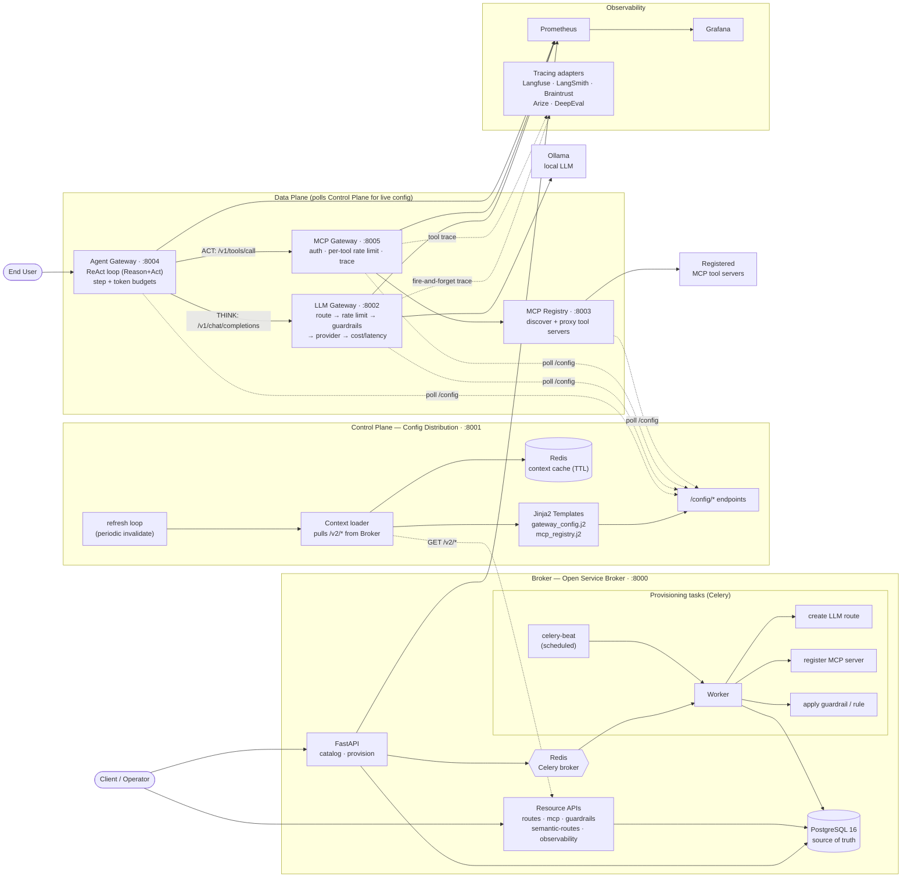
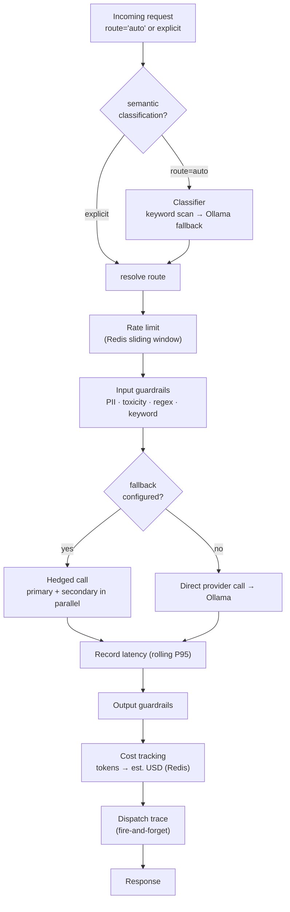
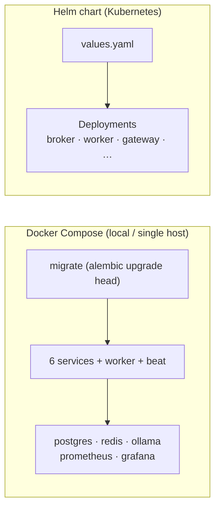

# LLM Control Plane — Architecture

A self-hosted, enterprise-grade AI gateway platform. Six FastAPI microservices split into a
**control plane** (declare/distribute config) and a **data plane** (serve live LLM + tool traffic),
backed by PostgreSQL, Redis, Ollama, and a Prometheus/Grafana + tracing observability stack.

This mirrors the classic "broker → control plane → fleet" shape of the reference diagram, but for
LLM/agent infrastructure instead of Envoy edge proxies.

---

## System flow

---

## Request lifecycle (LLM Gateway `/v1/chat/completions`)

---

## Deployment / Infrastructure

---

## Service map

| Service | Port | Role |
|---|---|---|
| **Broker** | 8000 | Open Service Broker. Stores routes, guardrails, semantic rules, MCP registrations, observability configs in PostgreSQL. Async provisioning via Celery + Redis. |
| **Control Plane** | 8001 | Reads from Broker, renders Jinja2 config templates, caches in Redis, serves live config; periodic refresh. |
| **LLM Gateway** | 8002 | Core LLM proxy to Ollama: semantic routing → rate limit → input guardrails → (hedged/fallback) call → output guardrails → cost + latency → trace dispatch. |
| **MCP Registry** | 8003 | Discovers + proxies registered MCP tool servers (refreshes every 60s). |
| **Agent Gateway** | 8004 | Orchestrates ReAct loops; calls LLM Gateway to *think*, MCP Gateway to *act*; enforces step + token budgets. |
| **MCP Gateway** | 8005 | Auth, per-tool rate limiting, tracing on every tool call before forwarding to MCP servers. |

**Key design patterns:** dynamic config (each plane polls the one above it) · semantic intent classification (keyword first, LLM fallback) · hedged requests (primary + secondary in parallel, take the winner) · guardrails on both input and output of every LLM call · fire-and-forget tracing to multiple observability backends.
